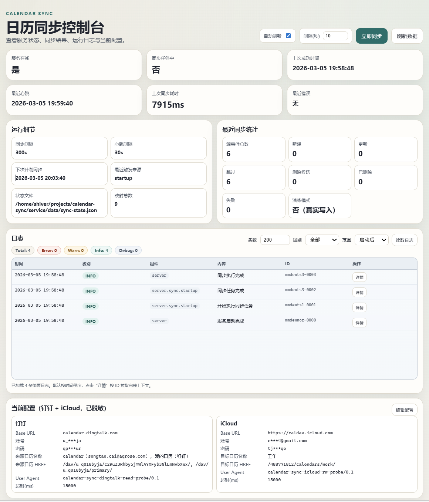

# Calendar Sync

将钉钉 CalDAV 日历（工作）单向同步到 iCloud 日历（统一查询入口），并提供 CLI、日志系统、Web 控制台，便于后续 Agent 以命令行方式接入。

## 核心能力

1. 单向同步：`钉钉 -> iCloud`（新增、更新、删除、幂等）。
2. 日历选择模型：钉钉来源日历支持多选；iCloud 目标日历支持单选（可留空自动选择可写日历）。
3. 删除保护：支持连续 missing 确认与删除比例保护。
4. 完整 CLI：
   - 同步控制：`sync once`
   - 服务状态：`status`
   - 日志读取：`logs`
   - iCloud 事件 CRUD：`icloud list/create/update/delete`
5. 日志系统：JSON 行日志（控制台 + 文件），CLI/UI/API 可读。
6. Web 控制台：查看状态、最近同步统计、日志、脱敏配置，并可手动触发同步。

## 快速开始

1. 准备 Node.js（建议 v20+）与 npm。
2. 安装依赖（本项目无三方依赖，保留命令以便后续扩展）：

```bash
npm install
```

3. 创建配置文件并填写真实凭据：

```bash
cp .env.example .env
```

说明：

1. 服务仅读取运行目录下的 `.env`，不会再从 `test/` 目录加载配置。
2. `DINGTALK_CALDAV_SOURCE_CALENDAR_*` 为空时默认读取钉钉全部可访问日历。
3. `ICLOUD_TARGET_CALENDAR_*` 为空时默认自动选择第一个可写目标日历。

4. 先跑连通性测试：

```bash
npm run test:dingtalk:read
npm run test:icloud:rw
```

5. 执行一次同步（建议先 DryRun）：

```bash
SYNC_DRY_RUN=true npm run sync:once
```

6. 执行真实同步：

```bash
SYNC_DRY_RUN=false npm run sync:once
```

## CLI 用法

统一入口：

```bash
npm run cli -- <command>
```

常用命令：

```bash
# 执行一次同步
npm run cli -- sync once --dry-run false --enable-delete true

# 查看服务状态（优先调用 /api/status，失败后本地兜底）
npm run cli -- status --json

# 查看日志
npm run cli -- logs summary --scope today --lines 200
npm run cli -- logs summary --level error --lines 100
npm run cli -- logs detail --id <LOG_ID>
npm run cli -- logs detail --from 2026-03-05T00:00:00Z --to 2026-03-05T12:00:00Z

# 查看/更新配置
npm run cli -- config get --json
npm run cli -- config set --key SYNC_INTERVAL_SECONDS --value 120
npm run cli -- config unset --key SYNC_API_TOKEN

# iCloud 日历与事件
npm run cli -- icloud calendars
npm run cli -- icloud list --start 2026-03-01T00:00:00Z --end 2026-03-31T23:59:59Z
npm run cli -- icloud create --title "评审会" --start 2026-03-10T01:00:00Z --end 2026-03-10T02:00:00Z
npm run cli -- icloud update --uid <UID> --title "评审会-改"
npm run cli -- icloud delete --uid <UID>
```

## 服务与 UI

启动常驻服务：

```bash
npm start
```

生产推荐参数启动：

```bash
npm run start:prod
```

控制台截图：



访问入口：

1. `GET /health`：健康检查。
2. `GET /api/status`：运行状态与最近结果。
3. `GET /api/logs`：日志简要/详细读取（支持 level、scope、id、时间段）。
4. `GET /api/logs/{id}`：按日志 ID 拉取单条详细日志。
5. `GET /api/config`：脱敏配置查看。
6. `GET /api/config/form`：配置编辑表单预填充数据（脱敏）。
7. `POST /api/config/discover-calendars`：按当前/输入凭据发现来源与目标日历。
8. `POST /api/config`：Web 保存配置到 `.env`。
9. `POST /api/sync`：手动触发同步。
10. `GET /`：Web 控制台页面。

日志检索推荐流程（节省 token）：

1. 先拿简要：`mode=summary` + `scope=today` 或 `scope=startup`。
2. 再按级别收敛：`level=error` / `warn`。
3. 锁定目标后，按 `id` 或 `from/to` 拉详细：`mode=detail`。

心跳机制：

1. 服务每 `HEARTBEAT_INTERVAL_SECONDS` 秒刷新一次 `lastHeartbeatAt`。
2. 可通过 `/health` 或 `/api/status` 查看心跳时间。

如果设置了 `SYNC_API_TOKEN`，触发同步时需带鉴权：

```bash
curl -s -X POST -H "Authorization: Bearer $SYNC_API_TOKEN" http://127.0.0.1:8787/api/sync
```

## Agent Skills

已新增技能目录：`../skills/icloud-calendar-ops`，用于让后续 Agent 稳定调用 iCloud 日历与运行分析能力。
该目录建议作为独立工程单独建仓发布。

常用调用：

```bash
# iCloud 日历操作（JSON）
../skills/icloud-calendar-ops/scripts/icloud-event.sh --service-repo /path/to/calendar-sync calendars
../skills/icloud-calendar-ops/scripts/icloud-event.sh --service-repo /path/to/calendar-sync list --start 2026-03-01T00:00:00Z --end 2026-03-31T23:59:59Z

# 运行诊断（JSON）
node ../skills/icloud-calendar-ops/scripts/runtime-report.js --service-repo /path/to/calendar-sync --lines 200
```

## 文档索引

1. 背景与设计文档：`docs/背景与设计文档.md`
2. 软件介绍：`docs/软件介绍.md`
3. 安装部署文档：`docs/安装部署文档.md`
